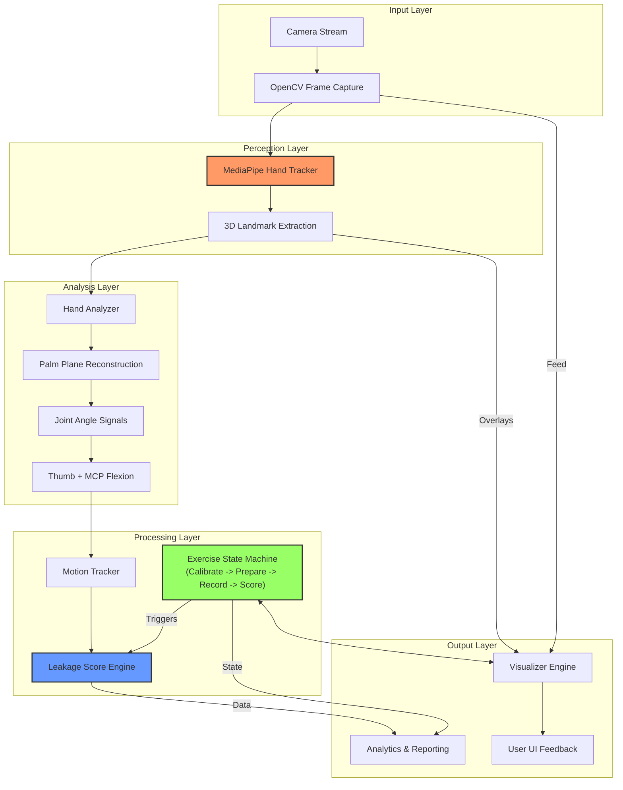

# Finger Independence Analyzer

A computer vision system that quantifies and analyzes individual finger motor control. By leveraging real-time 3D hand pose estimation, the Finger Independence Analyzer provides precise metrics on joint isolation, unintended "leakage" movement, and overall dexterity.

---

## How It Works 

The system transforms raw webcam video into joint-articulation metrics through a fixed, modular pipeline:

### 1. 3D Palm Plane Reconstruction
The analyzer constructs a dynamic 3D coordinate frame localized to the current hand pose.
- **Reference Points**: It uses the Wrist (0), Index MCP (5), and Pinky MCP (17) to define the Palm Plane.
- **Normal Vector Calculation**: A palm normal is calculated using a cross product.
- **Orientation Validation**: Recording is accepted only when the palm faces the camera (`palm_normal.z > 0.15`).

### 2. Biomechanical Metrics
For every valid frame, the analyzer computes:
- **MCP Flexion (Index/Middle/Ring/Pinky)**: Joint articulation from `(PIP-MCP)` and `(MCP-Wrist)` with straight posture near 180 degrees.
- **Thumb Composite Signal**: `0.6 * opposition + 0.4 * flexion`.
- **Temporal Smoothing**:
  - Landmark EMA smoothing in `hand_tracker.py`
  - 5-frame moving average on per-finger angle signals in `motion_tracker.py`
- **Baseline-Relative Motion**: `abs(baseline_angle - smoothed_angle)` with a `3°` physiological noise gate.
- **Optional Sideways Drift Signal**: Still computed by `analyzer.py` for diagnostics, not used in the current scoring formula.

### 3. The Independence Score
The score is leakage-based and only uses frames where the target finger moved enough:
- Frame leakage: `mean(motion[other] / motion[target])`
- Valid frame gate: `motion[target] >= 3°`
- Trial leakage: mean frame leakage over accepted frames
- Trial independence: `clamp(1 - trial_mean_leakage, 0, 1)`
- Finger score: mean of accepted trial-independence values
- Reliability: standard deviation of trial-independence values

### 4. Exercise Flow
The runtime state machine is:
`Idle -> Calibrate -> Prepare -> Recording -> Scoring -> Summary`

- **Calibrate**: collects a baseline over `45` valid frames.
- **Prepare**: countdown before a finger trial.
- **Recording**: captures leakage frames for the active finger.
- **Scoring**: finalizes the active finger’s trial aggregate.
- **Summary**: exports CSV and shows the bar chart report.

---

## Key Features

- **Robust Hand Tracking**: Real-time 21-point landmark extraction and full 3D hand pose reconstruction.
- **Handedness Independence**: Universal support for both Left and Right hand orientations with automatic coordinate adjustment.
- **Guided Exercise Mode**: A structured state machine (Calibrate -> Prepare -> Record -> Score) that facilitates standardized data capture for all five digits.
- **Leakage-Based Scoring**: Independence scoring based on normalized non-target coupling.
- **Live Feedback Engine**: Real-time per-finger trial score preview and session bars.
- **Automated Analytics**: CSV export (with trial reliability) and Matplotlib session plotting.

---

## Tech Stack

| Component | Technology | Use Case |
| :--- | :--- | :--- |
| **Language** | Python 3.10+ | Primary development language |
| **CV Engine** | [MediaPipe](https://mediapipe.dev/) | 21-point 3D hand landmark extraction |
| **Processing** | NumPy | High-performance vector mathematics and geometry |
| **Interface** | OpenCV | Camera capture, frame processing, and UI rendering |
| **Analytics** | Matplotlib | Generation of session performance graphs |
| **Data** | CSV | Session metric export |
| **Testing** | PyTest | Unit testing for biomechanical calculations |

---

## Installation

### Requirements
- **Python 3.10+**
- Webcam

> [!TIP]
> **macOS (Apple Silicon) Users**  
> Use a virtual environment and MediaPipe version `0.10.13` for best compatibility and performance.

```bash
# Clone the repository
git clone <repository_url>
cd finger-independence

# Setup virtual environment
python3 -m venv venv
source venv/bin/activate

# Install dependencies
pip install -r requirements.txt
```

---

## Usage

Launch the main application:
```bash
python3 main.py
```

### Session Controls
| Key | Action |
|:---:|:---|
| `Space` | Start Session (from Idle) |
| `P` | Pause/Resume exercise |
| `R` | Reset entire session |
| `S` | Skip current finger |
| `Q` | Quit application |

---

## System Architecture

The project follows a modular pipeline architecture, processing raw visual data into structured biomechanical metrics.



### Component Breakdown
- **`hand_tracker.py`**: MediaPipe abstraction and landmark filtering.
- **`analyzer.py`**: Core biomechanical math (palm frame, MCP flexion, thumb opposition/flexion).
- **`motion_tracker.py`**: Angle smoothing and baseline-relative thresholded motion.
- **`score_engine.py`**: Frame-level leakage and independence conversion.
- **`exercise_mode.py`**: Finite State Machine managing timing and user flow.
- **`visualizer.py`**: Rendering of the interface and skeletal overlays.
- **`analytics.py`**: Trial aggregation, reliability (std-dev), CSV export, and plotting.

---

## Testing

The project includes unit tests for:
- state-machine timing and transitions
- analyzer angle behavior and edge-case fallback
- motion smoothing and thresholded motion outputs
- leakage scoring and coupling behavior
- analytics trial aggregation behavior

```bash
python3 -m pytest tests/
```
