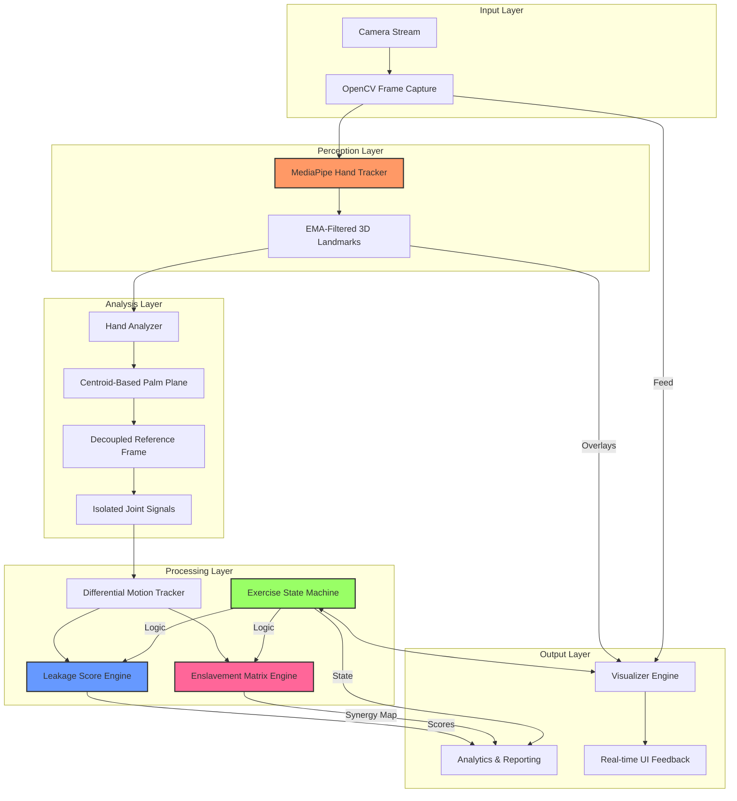

# Finger Independence Analyzer

A computer vision system that quantifies and analyzes individual finger motor control. By leveraging real-time 3D hand pose estimation, the Finger Independence Analyzer provides precise metrics on joint isolation, unintended "leakage" movement, and overall dexterity.

---

## How It Works 

The system transforms raw webcam video into joint-articulation metrics through a fixed, modular pipeline:

### 1. 3D Palm Plane Reconstruction
The analyzer constructs a dynamic 3D coordinate frame localized to the current hand pose.
- **Reference Points**: It uses the **Centroid of all finger MCPs** (Index 5, Middle 9, Ring 13, Pinky 17) to define the Hand's stable origin.
- **Normal Vector Calculation**: A palm normal is calculated by cross-referencing the hand's longitudinal axis (Wrist to Centroid) with its transverse span (Index MCP to Pinky MCP).
- **Orientation Validation**: Recording is accepted only when the palm faces the camera (`palm_normal.z > 0.15`).

### 2. Biomechanical Metrics
For every valid frame, the analyzer computes:
- **MCP Flexion (Index/Middle/Ring/Pinky)**: Joint articulation from `(PIP-MCP)` and `(MCP-Wrist)` with straight posture near 180 degrees.
- **Thumb Composite Signal**: `0.6 * opposition + 0.4 * flexion`.
- **Signal Decoupling**: Thumb opposition is measured against a derived stable axis orthogonal to the palm normal, preventing movement in fingers (like the index) from polluting the thumb's tracking data.
- **Temporal Smoothing**:
  - Landmark EMA smoothing in `hand_tracker.py`
  - 5-frame moving average on per-finger angle signals in `motion_tracker.py`
- **Baseline-Relative Motion**: `abs(baseline_angle - smoothed_angle)` with a `1.5°` physiological noise gate.
- **Optional Sideways Drift Signal**: Still computed by `analyzer.py` for diagnostics, not used in the current scoring formula.

### 3. The Independence Score & Enslavement Matrix
The system quantifies motor control using two primary metrics:

#### A. Independence Score (The "Big Number")
A frame-by-frame leakage analysis filtered by target activity:
- **Frame Leakage**: $L = \text{mean}(motion_{other} / motion_{target})$
- **Valid Frame Gate**: Data is only captured when $motion_{target} \geq 2^\circ$
- **Trial Independence**: $I = \text{clamp}(1 - L_{trial}, 0, 1)$
- **Final Score**: The primary metric representing overall isolation quality.

#### B. Enslavement Matrix (Synergy Mapping)
A 5x5 heatmap where $M_{ij}$ represents the unintended movement of finger $j$ when finger $i$ is the target.
- **Synergy Mapping**: High-fidelity heatmaps identify specific neuromuscular coupling patterns.
- **Analytical Depth**: Quantifies how much each individual finger "slave" follows a target "master" digit.

### 4. Exercise Flow
The runtime state machine is:
`Idle -> Calibrate -> Prepare -> Recording -> Scoring -> Summary`

- **Calibrate**: collects a baseline over `45` valid frames.
- **Prepare**: countdown before a finger trial.
- **Recording**: captures leakage and enslavement data for the active finger.
- **Scoring**: finalizes the active finger’s trial aggregate and enslavement row.
- **Summary**: exports CSV and generates a dual-report (Bars + Heatmap).

### 5. User Authentication & History
The system supports a full Supabase-backed authentication module:
- **Sign Up / Login**: Users can create custom accounts (username/password) to securely track their progress over time.
- **Session History**: After logging in, a built-in dashboard displays the last 5 sessions, allowing users to review their previous scores (stored securely in a Supabase cloud database) before starting a new diagnostic cycle.

---

## Key Features

- **Robust Hand Tracking**: Real-time 21-point landmark extraction and full 3D hand pose reconstruction.
- **Secure User Profiles**: Dynamically create profiles and retrieve historical telemetry via Supabase integration.
- **Handedness Independence**: Universal support for both Left and Right hand orientations.
- **Enslavement Matrix (Synergy Mapping)**: Deep-dive analysis of cross-finger motion correlations.
- **Guided Exercise Mode**: A structured state machine that facilitates standardized data capture.
- **Leakage-Based Scoring**: Independence scoring based on normalized non-target coupling.
- **High-Fidelity Reporting**: Visualizes session results using Matplotlib bars and Seaborn heatmaps.

---

## Tech Stack

| Component | Technology | Use Case |
| :--- | :--- | :--- |
| **Language** | Python 3.10+ | Primary development language |
| **CV Engine** | [MediaPipe](https://mediapipe.dev/) | 3D hand landmark extraction |
| **Processing** | NumPy / Pandas | Vector math and data structuring |
| **Interface** | OpenCV | Camera capture and real-time UI |
| **Analytics** | Matplotlib / Seaborn | Professional session reporting |
| **Data** | CSV | Metric export for research |
| **Testing** | PyTest | Production-grade unit testing |

---

## Installation

### Requirements
- **Python 3.10+**
- Webcam

> [!TIP]
> **macOS (Apple Silicon) Users**  
> Use a virtual environment and MediaPipe version `0.10.13` for best compatibility and performance.

```bash
# Clone the repository
git clone <repository_url>
cd finger-independence

# Setup virtual environment
python3 -m venv venv
source venv/bin/activate

# Install dependencies
pip install -r requirements.txt
```

---

## Usage

Launch the main application:
```bash
python3 main.py
```

### Session Controls
| Key | Action |
|:---:|:---|
| `Space` | Start Session (from Idle) |
| `P` | Pause/Resume exercise |
| `R` | Reset entire session |
| `S` | Skip current finger |
| `Q` | Quit application |

---

## Project Structure

```text
.
├── src/
│   └── finger_independence/
│       ├── analytics.py       # Trial aggregation & Heatmap generation
│       ├── analyzer.py        # Biomechanical math (Palm Plane, MCP Flexion)
│       ├── config.py          # Centralized configuration & thresholds
│       ├── exercise_mode.py   # State machine logic
│       ├── hand_tracker.py    # MediaPipe abstraction & EMA filtering
│       ├── motion_tracker.py  # Angle smoothing & motion detection
│       ├── score_engine.py    # Leakage scoring logic
│       └── visualizer.py      # Real-time UI rendering
├── tests/                     # Comprehensive PyTest suite
├── data/                      # Session CSVs and generated PNG reports
├── main.py                    # Application entry point
├── requirements.txt           # Dependency management
└── README.md
```

---

## System Architecture


```mermaid
graph TD
    subgraph "Input Layer"
        A[Camera Stream] --> B[OpenCV Frame Capture]
    end

    subgraph "Perception Layer"
        B --> C[MediaPipe Hand Tracker]
        C --> D[EMA-Filtered 3D Landmarks]
    end

    subgraph "Analysis Layer"
        D --> E[Hand Analyzer]
        E --> F[Centroid-Based Palm Plane]
        F --> G[Decoupled Reference Frame]
        G --> H[Isolated Joint Signals]
    end

    subgraph "Processing Layer"
        H --> I[Differential Motion Tracker]
        I --> J[Leakage Score Engine]
        I --> P[Enslavement Matrix Engine]
        K["Exercise State Machine"] -- Logic --> J
        K -- Logic --> P
    end

    subgraph "Output Layer"
        J -- Scores --> N[Analytics & Reporting]
        P -- Synergy Map --> N
        K -- State --> N
        K <--> M[Visualizer Engine]
        D -- Overlays --> M
        B -- Feed --> M
        M --> O[Real-time UI Feedback]
    end

    style C fill:#f96,stroke:#333,stroke-width:2px
    style J fill:#69f,stroke:#333,stroke-width:2px
    style P fill:#f69,stroke:#333,stroke-width:2px
    style K fill:#9f6,stroke:#333,stroke-width:2px
```

## Testing

The project includes a comprehensive suite of unit tests covering biomechanical math, signal isolation, and state machine transitions.

```bash
pytest tests/
```


