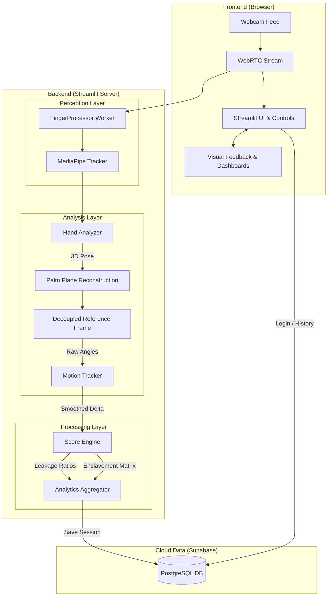

# Finger Independence Analyzer

A computer vision system that quantifies and analyzes individual finger motor control. By leveraging real-time 3D hand pose estimation via WebRTC, the Finger Independence Analyzer provides precise metrics on joint isolation, unintended "leakage" movement, and overall dexterity directly in the browser.

---

## How It Works (System Design & Algorithms)

The system transforms raw webcam video into joint-articulation metrics through a fixed, modular pipeline using MediaPipe for pose estimation, and custom biomechanical algorithms for motion tracking.

### 1. 3D Palm Plane Reconstruction & Localization
The `HandAnalyzer` constructs a dynamic 3D coordinate frame localized to the current hand pose. This ensures calculations are invariant to the hand's absolute position in the camera frame.
- **Reference Centroid**: Computes the centroid of the Index (5), Middle (9), Ring (13), and Pinky (17) MCP (Metacarpophalangeal) joints to establish a stable origin.
- **Axes Derivation**: 
  - *Longitudinal Axis*: Vector from the Wrist (0) to the MCP Centroid.
  - *Transverse Axis*: Vector from Index MCP (5) to Pinky MCP (17).
- **Normal Vector Calculation**: A palm normal vector is calculated via the cross product of the Longitudinal and Transverse axes. For left hands, the normal is inverted to maintain consistency.
- **Orientation Validation**: To prevent occlusions and invalid data, recording is only accepted when the palm is facing the camera (`palm_normal.z > 0.15`).

### 2. Biomechanical Metrics & Signal Decoupling
For every valid frame, joint angles are extracted in degrees:
- **Finger Flexion (Index, Middle, Ring, Pinky)**: Calculated as the supplementary angle between the proximal phalanges vector `(PIP - MCP)` and the metacarpal vector `(MCP - Wrist)`. A perfectly straight finger registers near 180°.
- **Thumb Composite Signal**: The thumb's biomechanics are complex (involving both flexion and opposition). To prevent movement in other fingers from polluting the thumb's tracking data, a *Stable Reference Axis* is derived orthogonally to both the palm normal and longitudinal axis.
  - *Thumb Opposition*: Angle between the thumb direction `(PIP - MCP)` and the Stable Reference Axis.
  - *Thumb Flexion*: Supplementary angle between `(MCP - PIP)` and `(PIP - Wrist)`.
  - *Composite Score*: `0.6 * opposition + 0.4 * flexion`.
- **Temporal Smoothing**: The `MotionTracker` applies a 5-frame moving average to all raw angle signals to mitigate MediaPipe's high-frequency jitter.
- **Baseline-Relative Motion (Noise Gate)**: During the Calibration phase, baseline resting angles are established. Frame-by-frame motion is calculated as `abs(current_angle - baseline_angle)`. A physiological noise gate of `1.5°` is applied; any deviation below this threshold is clamped to `0.0` to filter out natural micro-tremors.

### 3. Independence Scoring & Enslavement Matrix
The system quantifies motor control using two primary metrics derived in the `ScoreEngine`:
- **Frame Leakage & Target Gate**: Data is only recorded when the target finger's motion exceeds a `2.0°` threshold. For these valid frames, frame leakage $L$ is calculated as the mean ratio of non-target motion to target motion:  
  $L = \frac{1}{4} \sum_{j \neq target} \left( \frac{motion_j}{motion_{target}} \right)$
- **Trial Independence Score**: The frame leakage is mapped to an independence score: $I = \max(0, 1 - L)$. This represents the overall isolation quality (1.0 = perfect isolation, 0.0 = complete coupling).
- **Enslavement Matrix (Synergy Mapping)**: A 5x5 heatmap $C$ where $C_{j,i}$ represents the maximum observed coupling ratio of finger $j$ (slave) when finger $i$ is the target (master). This identifies specific neuromuscular coupling patterns and tendon tethering.

### 4. Exercise Flow State Machine
The application guides the user through the following strict state machine to ensure standardized data capture:
`Idle -> Calibrate (N frames) -> Prepare (Countdown) -> Recording -> Scoring -> Summary`

### 5. User Authentication & Cloud History
The system features a complete Streamlit-Supabase integration:
- **Sign Up / Login**: Users can create custom accounts to securely track their progress over time.
- **Session History Dashboard**: Displays the last 5 sessions, allowing users to review their previous total scores and per-finger metrics seamlessly.

---

## Key Features

- **Web-Based Tracking**: Real-time 21-point landmark extraction over WebRTC using Streamlit.
- **Cloud Deployable**: Ready for deployment on cloud platforms like Hugging Face Spaces.
- **Secure User Profiles**: Supabase integration for authentication and secure session telemetry storage.
- **Enslavement Matrix**: Deep-dive analysis of cross-finger motion correlations.
- **Leakage-Based Scoring**: Independence scoring based on normalized non-target coupling.
- **Professional Analytics**: Visualizes session results with integrated Matplotlib and Seaborn graphs in the browser.

---

## Tech Stack

| Component | Technology | Use Case |
| :--- | :--- | :--- |
| **Language** | Python 3.10+ | Primary development language |
| **Web Framework** | [Streamlit](https://streamlit.io/) | Full-stack web application and UI |
| **Video Streaming** | [Streamlit-WebRTC](https://github.com/whitphx/streamlit-webrtc) | Browser-based real-time video capture |
| **CV Engine** | [MediaPipe](https://mediapipe.dev/) | 3D hand landmark extraction |
| **Backend / DB** | [Supabase](https://supabase.com/) | Authentication & PostgreSQL session storage |
| **Processing** | NumPy / Pandas / OpenCV | Vector math, data structuring, and image manipulation |
| **Analytics** | Matplotlib / Seaborn | Professional session reporting |

---

## Installation

### Requirements
- **Python 3.10+**
- Webcam
- Supabase Project (for database and authentication)

### Setup

```bash
# Clone the repository
git clone <repository_url>
cd finger-independence

# Setup virtual environment
python3 -m venv venv
source venv/bin/activate

# Install dependencies
pip install -r requirements.txt
```

### Environment Variables
Create a `.env` file in the root directory and add your Supabase credentials and optional TURN server credentials for WebRTC:
```env
SUPABASE_URL="your_supabase_project_url"
SUPABASE_KEY="your_supabase_anon_key"
METERED_DOMAIN="your_turn_server_domain"
METERED_API_KEY="your_turn_server_api_key"
```

---

## Usage

Launch the web application:
```bash
streamlit run main.py
```

### Session Controls
Navigate the exercise using the on-screen buttons provided in the Streamlit UI:
- **Start Session**: Begins the calibration and exercise sequence.
- **Pause / Resume**: Pauses or resumes the current tracking state.
- **Skip Finger**: Skips recording for the currently active finger.
- **Restart**: Aborts the current session and returns to idle.

---

## Project Structure

```text
.
├── src/
│   └── finger_independence/
│       ├── analytics.py       # Trial aggregation & Heatmap generation
│       ├── analyzer.py        # Biomechanical math & signal decoupling
│       ├── auth.py            # Supabase authentication logic
│       ├── config.py          # Centralized configuration & thresholds
│       ├── db_client.py       # Supabase database client
│       ├── exercise_mode.py   # State machine logic
│       ├── hand_tracker.py    # MediaPipe abstraction
│       ├── motion_tracker.py  # Angle smoothing & motion detection
│       ├── score_engine.py    # Independence & leakage scoring logic
│       └── visualizer.py      # Frame overlays
├── tests/                     # Comprehensive PyTest suite
├── main.py                    # Streamlit WebRTC application entry point
├── supabase_schema.sql        # Database schema for Supabase
├── requirements.txt           # Dependency management
└── README.md
```

## System Architecture


```mermaid
graph TD
    subgraph "Frontend (Browser)"
        A[Webcam Feed] --> B[WebRTC Stream]
        B --> C[Streamlit UI & Controls]
        C <--> N[Visual Feedback & Dashboards]
    end

    subgraph "Backend (Streamlit Server)"
        B --> D[FingerProcessor Worker]
        
        subgraph "Perception Layer"
            D --> E[MediaPipe Tracker]
        end
        
        subgraph "Analysis Layer"
            E --> F[Hand Analyzer]
            F -->|3D Pose| F1[Palm Plane Reconstruction]
            F1 --> F2[Decoupled Reference Frame]
            F2 -->|Raw Angles| G1
        end

        subgraph "Processing Layer"
            G1[Motion Tracker] -->|Smoothed Delta| G2[Score Engine]
            G2 -->|Leakage Ratios| H[Analytics Aggregator]
            G2 -->|Enslavement Matrix| H
        end
    end

    subgraph "Cloud Data (Supabase)"
        H -- Save Session --> I[(PostgreSQL DB)]
        C -- Login / History --> I
    end
```

## Testing

The project includes a comprehensive suite of unit tests covering biomechanical math, signal isolation, and state machine transitions.

```bash
pytest tests/
```
